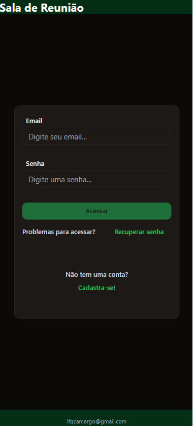

# Sistema de Agendamento de Reuniões

## Descrição

O **Sistema de Agendamento de Reuniões** é uma solução moderna e eficiente para o gerenciamento de reuniões corporativas e eventos. Ele permite que os usuários organizem horários, participantes e locais de maneira simples e intuitiva, otimizando a produtividade e o planejamento.

## Funcionalidades

### Agendamento de Reuniões
- **Criação de Eventos:** Agende reuniões com detalhes como título, descrição, data, horário, local e participantes.
- **Gerenciamento de Conflitos:** Notifica sobre conflitos de horário para evitar sobreposição de eventos.
- **Convites:** Envie convites automáticos por e-mail para os participantes.

### Controle de Participantes
- **Cadastro de Usuários:** Gerencie informações dos participantes, incluindo nomes, e-mails e status de confirmação.
- **Confirmação de Presença:** Rastreie confirmações e visualize a lista de participantes confirmados e pendentes.

### Interface Web
- **Dashboard Intuitivo:** Uma visão geral clara de todas as reuniões agendadas, com filtros por data, usuário ou status.
- **Visualização de Calendário:** Um calendário interativo que facilita a visualização e organização dos eventos.

### Notificações
- **Lembretes Automatizados:** Notificações para lembrar os participantes sobre reuniões agendadas.
- **Alterações em Tempo Real:** Alerta imediato sobre mudanças nos horários ou cancelamentos.

## Capturas de Tela

Veja abaixo algumas imagens do sistema para entender melhor sua interface e funcionalidades:

